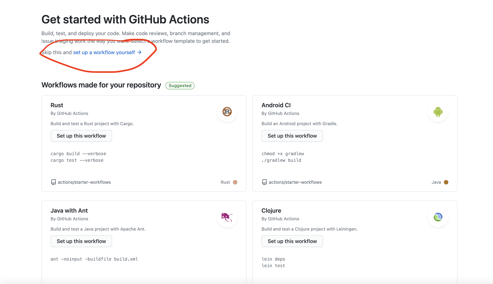
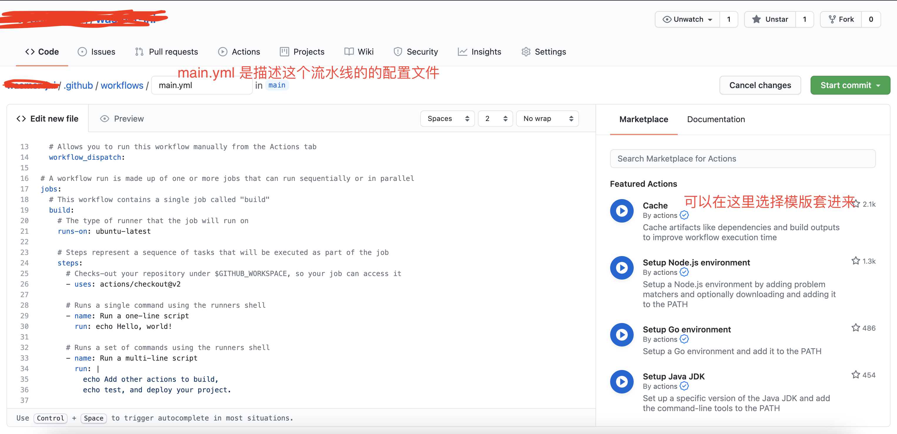
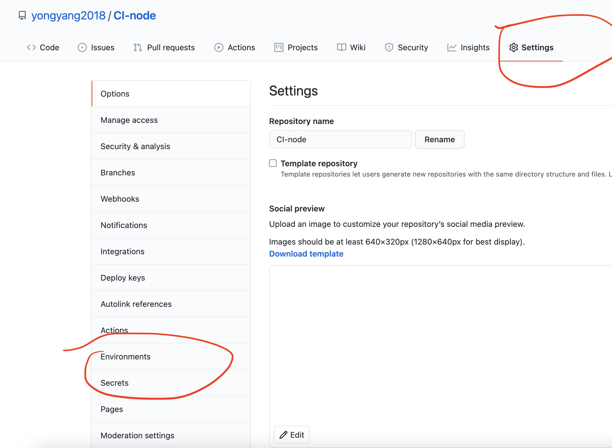
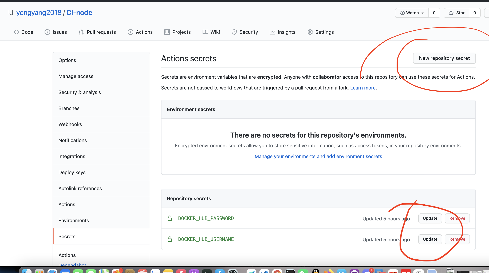

# github-action-guide

github action 配置文件编写指引

## github action 简介

github action 提供了在特定事件触发时之行自动化流水线的功能，常被用于构建 docker 镜像，发布和部署。

## 创建新的 Github Action

- 创建 Github Action 需要对仓库拥有写入权限，点击 Actions 按钮


- 如果这个仓库从来没创建过任何 Github Action, 点击 Actions 按钮后会进入选择模版的界面



- 针对不同类型的项目，Github 提供了不同类型的模版，点击 set up a workflow yourself，则会跳过选择模版，进入自定义编辑页面




## 编写 Github Action(以 nodejs 为例)

下面以 nodejs 后端项目为例，描述 Github Action 创建的过程，代码仓库位于 https://github.com/yongyang2018/CI-node

- 配置文件的格式是 yml， 配置文件必须在 github 网页上修改，在本地修改再提交会被 github 服务器拒绝
  
- 编写触发条件

```yml
# 给这条流水线起一个名称
name: CI

# on 代表流水线的触发条件
on:
  push:
    branches: release* # 支持通配符, 当 release 前缀分支有代码提交时触发流水线

  tags:
    - v* # 支持通配符，当打以 v 开头的 tag 时触发流水线
```    

### 声明环境变量


```yml
env:
  IMAGE: ci-node
```

  环境变量可以给 docker 镜像起名，这个环境变量可以在后面的命令或者 .sh 文件中用 ```$IMAGE``` 引用


### 编写任务

1. 任务都写在 jobs 下面，每个 job 可以包含许多 step，一般建议使用单个 job，使用 runs-on 设置执行的环境，第一个 step 一般是检出项目代码。


2. ubuntu-latest 默认包含了 docker 环境，默认使用 bash 作为 shell


3. 下一步针对不同的项目，可以设置不同的执行环境，例如 nodejs 项目，可以设置 node 环境，对于 java 项目，需要设置 jdk 环境


```yml
jobs:
  # 声明了一个 job, 起名为 push
  push:

    # 声明 job 执行的环境
    runs-on: ubuntu-latest


    steps:       
      # 检出项目代码
      - name: Checkout
        uses: actions/checkout@v2
        
      # 设置 node 环境  
      - name: Setup Node.js environment
        uses: actions/setup-node@v2.4.0
        with:    
          node-version: 14

      # 缓存器，当 package.json 没有变化时，从缓存中加载 node_modules
      - uses: actions/cache@v2
        with:
          path: ~/.npm
          key: ${{ runner.os }}-node-${{ hashFiles('package.json') }}      
 
```

### 编写 Dockerfile

在项目根目录下创建名为 Dockerfile 的文件

```Dockerfile
FROM node:14-alpine  # 指定 nodejs 版本
ENV PORT 3000        
RUN mkdir -p /app    # 创建 /app 文件夹
WORKDIR /app         # 指定 /app 文件夹为 docker 容器的默认工作路径
ADD . /app           # 把项目根目录下的所有文件复制到 /app 文件夹下面
EXPOSE 3000          # 默认开放 3000 端口
ENTRYPOINT [ "node", "index.js"]  # 程序的入口
```

### 编写 docker 编译脚本

- 在项目根目录下创建 docker/build.sh 文件，填入以下代码


```sh
#!/usr/bin/env bash

# 声明后，这个脚本文件遇到异常情况会终止执行
set -e 

# directory of this file，获取当前文件，也就是 build.sh 文件所在目录
CUR=$(dirname $0)
CUR=`cd $CUR; pwd`

# project root path, 因为 build.sh 在 docker 文件夹下面
# 所以 CUR/.. 是项目的根目录
PROJ_ROOT=$CUR/..

# 打印环境变量 IMAGE，这是我们要编译的 docker 镜像的名称
# 因为 Github Action 中声明的环境变量 IMAGE=ci-node
# 所以这里打印出来的是 ci-node
echo "image name = $IMAGE"

# 切换工作目录到项目根目录下
pushd $PROJ_ROOT >> /dev/null

# install dependencies
# 安装 node_modules 依赖
# 这里需要在 docker build 之前执行，
# 因为要把 node_modules 和源代码一起复制到 docker 镜像中
npm i

# build docker image
# 编译 docker 镜像
docker build -f Dockerfile -t $IMAGE .

# 将当前工作目录恢复到执行 pushd 之前的状态
popd >> /dev/null
```

### 继续编写任务

有了 Dockerfile 和 docker/build.sh 后，我们可以继续添加 step, 添加的内容就是执行 docker/build.sh

```yml
jobs:
  # 声明了一个 job, 起名为 push
  push:

    # 声明 job 执行的环境
    runs-on: ubuntu-latest


    steps:       
      # 检出项目代码
      # 略
      #

      # 编译出 docker 镜像，命名为 $IMAGE 保存在本地
      - name: Build image
        run: bash docker/build.sh
      
      # 登陆 docker hub
      - name: Log into registry
        run: echo "${{ secrets.DOCKER_HUB_PASSWORD }}" | docker login -u "${{ secrets.DOCKER_HUB_USERNAME }}" --password-stdin

      # tag 并且把 docker 镜像推送到 docker hub
      - name: Push image
        run: |
          # tag 的名称
          IMAGE_ID="${{ secrets.DOCKER_HUB_USERNAME }}/$IMAGE"
          
          # Strip git ref prefix from version
          # github.ref 是 github action 内置变量
          # 可以从 github.ref 读取到代码的分支或者 tag 名称
          # 再从代码分支或者 tag 名称读取代码版本号
          VERSION=$(echo "${{ github.ref }}" | sed -e 's,.*/\(.*\),\1,')
          
          # Strip "release-" prefix from branch name 
          [[ "${{ github.ref }}" == "refs/heads/release-"* ]] && VERSION=$(echo $VERSION | sed -e 's/^release-//')    
          
          # Use Docker `latest` tag on release branch
          [ "$VERSION" == "release" ] && VERSION=latest

          # 到这里 $VERSION 就是代码版本号了
          echo IMAGE_ID=$IMAGE_ID
          echo VERSION=$VERSION
          docker tag $IMAGE $IMAGE_ID:$VERSION
          docker push $IMAGE_ID:$VERSION      
```          


### 注入密码等参数

有些 Github Action 需要访问密码等参数，这些参数是不可以写在配置文件里的, 例如 dockerhub 的用户名和密码，这里可以用 secrets 设置和访问


- 设置 secrets 需要对仓库拥有管理员权限

- 点击 settings 中的 secrets 可以进入 secrets 设置界面



- 可以点击 update 更新 secrets




- 可以在配置文件中用 ```${{ secrets.DOCKER_HUB_USERNAME }}``` 引用 secrets 变量，secrets 变量不会在 Github action 的日志中出现

### 配置文件总结

https://github.com/yongyang2018/CI-node/blob/main/.github/workflows/docker-image.yml    


## 编写 Github Action(以 spring 为例)

下面以 spring 项目为例，描述 Github Action 创建的过程，代码仓库位于 https://github.com/yongyang2018/CI-spring

- 配置文件的格式是 yml， 配置文件必须在 github 网页上修改，在本地修改再提交会被 github 服务器拒绝
  
- 编写触发条件

```yml
# 给这条流水线起一个名称
name: CI

# on 代表流水线的触发条件
on:
  push:
    branches: release* # 支持通配符, 当 release 前缀分支有代码提交时触发流水线

  tags:
    - v* # 支持通配符，当打以 v 开头的 tag 时触发流水线
```    

### 声明环境变量


```yml
env:
  IMAGE: ci-spring
```

  环境变量可以给 docker 镜像起名，这个环境变量可以在后面的命令或者 .sh 文件中用 ```$IMAGE``` 引用


### 编写任务

1. 任务都写在 jobs 下面，每个 job 可以包含许多 step，一般建议使用单个 job，使用 runs-on 设置执行的环境，第一个 step 一般是检出项目代码。


2. ubuntu-latest 默认包含了 docker 环境，默认使用 bash 作为 shell


3. 下一步针对不同的项目，可以设置不同的执行环境，例如 java 项目，可以设置 jdk 环境


```yml
jobs:
  # 声明了一个 job, 起名为 push
  push:

    # 声明 job 执行的环境
    runs-on: ubuntu-latest


    steps:       
    # 检出项目代码
    - uses: actions/checkout@v2
    
    # 设置 openjdk 环境
    - name: setup jdk11
      uses: actions/setup-java@v2.2.0
      with:
        java-version: 11
        distribution: adopt-hotspot
    
    # 缓存 gradle
    - uses: actions/cache@v2
      with:
       path: |
          ~/.gradle/caches
          ~/.gradle/wrapper
       key: ${{ runner.os }}-gradle-${{ hashFiles('**/*.gradle*', '**/gradle-wrapper.properties') }}
       restore-keys: |
         ${{ runner.os }}-gradle-    
 
```

### 编写 Dockerfile

在项目根目录下创建 docker/Dockerfile 的文件

```Dockerfile
FROM adoptopenjdk:11.0.11_9-jre-hotspot  # 指定 jdk 版本

RUN mkdir /app
WORKDIR /app

ADD build/*.jar /app/app.jar             # 复制 jar 文件

ENTRYPOINT java -jar ./app.jar           # 程序入口

EXPOSE 8080
```

### 编写 docker 编译脚本

- 在项目根目录下创建 docker/build.sh 文件，填入以下代码


```sh
#!/usr/bin/env bash

# 声明后，这个脚本文件遇到异常情况会终止执行
set -e 

# directory of this file，获取当前文件，也就是 build.sh 文件所在目录
CUR=$(dirname $0)
CUR=`cd $CUR; pwd`

# project root path, 因为 build.sh 在 docker 文件夹下面
# 所以 CUR/.. 是项目的根目录
PROJ_ROOT=$CUR/..

# 打印环境变量 IMAGE，这是我们要编译的 docker 镜像的名称
# 因为 Github Action 中声明的环境变量 IMAGE=ci-spring
# 所以这里打印出来的是 ci-spring
echo "image name = $IMAGE"

# 切换工作目录到项目根目录下
pushd $PROJ_ROOT >> /dev/null

# 测试和编译 jar 文件
./gradlew build
./gradlew clean
./gradlew bootJar

# 清理和创建临时 build 目录
rm -rf docker/build
mkdir docker/build
cp build/libs/*.jar docker/build

# build docker image
# 编译 docker 镜像
# build docker image
pushd docker >> /dev/null
docker build -f Dockerfile -t $IMAGE .
popd >> /dev/null

# 清理临时 build 目录
rm -rf docker/build
# 将当前工作目录恢复到执行 pushd 之前的状态
popd >> /dev/null
```

### 继续编写任务

有了 Dockerfile 和 docker/build.sh 后，我们可以继续添加 step, 添加的内容就是执行 docker/build.sh

```yml
jobs:
  # 声明了一个 job, 起名为 push
  push:

    # 声明 job 执行的环境
    runs-on: ubuntu-latest


    steps:       
      # 检出项目代码
      # 略
      #

      # 编译出 docker 镜像，命名为 $IMAGE 保存在本地
      - name: Build image
        run: bash docker/build.sh
      
      # 登陆 docker hub
      - name: Log into registry
        run: echo "${{ secrets.DOCKER_HUB_PASSWORD }}" | docker login -u "${{ secrets.DOCKER_HUB_USERNAME }}" --password-stdin

      # tag 并且把 docker 镜像推送到 docker hub
      - name: Push image
        run: |
          # tag 的名称
          IMAGE_ID="${{ secrets.DOCKER_HUB_USERNAME }}/$IMAGE"
          
          # Strip git ref prefix from version
          # github.ref 是 github action 内置变量
          # 可以从 github.ref 读取到代码的分支或者 tag 名称
          # 再从代码分支或者 tag 名称读取代码版本号
          VERSION=$(echo "${{ github.ref }}" | sed -e 's,.*/\(.*\),\1,')
          
          # Strip "release-" prefix from branch name 
          [[ "${{ github.ref }}" == "refs/heads/release-"* ]] && VERSION=$(echo $VERSION | sed -e 's/^release-//')    
          
          # Use Docker `latest` tag on release branch
          [ "$VERSION" == "release" ] && VERSION=latest

          # 到这里 $VERSION 就是代码版本号了
          echo IMAGE_ID=$IMAGE_ID
          echo VERSION=$VERSION
          docker tag $IMAGE $IMAGE_ID:$VERSION
          docker push $IMAGE_ID:$VERSION      
```          


### 注入密码等参数

有些 Github Action 需要访问密码等参数，这些参数是不可以写在配置文件里的, 例如 dockerhub 的用户名和密码，这里可以用 secrets 设置和访问


- 设置 secrets 需要对仓库拥有管理员权限

- 点击 settings 中的 secrets 可以进入 secrets 设置界面


- 可以点击 update 更新 secrets


- 可以在配置文件中用 ```${{ secrets.DOCKER_HUB_USERNAME }}``` 引用 secrets 变量，secrets 变量不会在 Github action 的日志中出现

### 配置文件总结

https://github.com/yongyang2018/CI-spring/blob/main/.github/workflows/docker-image.yml  


## 编写 Github Action(以 webpack 为例)

下面以 webpack 项目为例，描述 Github Action 创建的过程，代码仓库位于 https://github.com/yongyang2018/CI-webpack

此流水线最终会把 webpack 编译结果部署到 aws s3 

- 配置文件的格式是 yml， 配置文件必须在 github 网页上修改，在本地修改再提交会被 github 服务器拒绝
  
- 编写触发条件

```yml
# 给这条流水线起一个名称
name: deoploy to s3

# on 代表流水线的触发条件
on:
  push:
    branches: release # 因为这个流水线是用于部署到生产环境，所以只有在 release 分支有改动时会触发

```    


### 编写任务

1. 任务都写在 jobs 下面，每个 job 可以包含许多 step，一般建议使用单个 job，使用 runs-on 设置执行的环境，第一个 step 一般是检出项目代码。


2. ubuntu-latest 默认包含了 docker 环境，默认使用 bash 作为 shell


3. 下一步针对不同的项目，可以设置不同的执行环境，例如 nodejs 项目，可以设置 node 环境，对于 java 项目，需要设置 jdk 环境


```yml
jobs:
  # 声明了一个 job, 起名为 push
  push:

    # 声明 job 执行的环境
    runs-on: ubuntu-latest


    steps:       
      # 检出项目代码
      - name: Checkout
        uses: actions/checkout@v2

      # 登陆 aws 命令行, 所需的参数需要通过 secrets 读取，具体见下文
      uses: aws-actions/configure-aws-credentials@v1
      with:
        # AWS Access Key ID. This input is required if running in the GitHub hosted environment. It is optional if running in a self-hosted environment that already has AWS credentials, for example on an EC2 instance.
        aws-access-key-id: ${{ secrets.AWS_ACCESS_KEY_ID }}
        # AWS Secret Access Key. This input is required if running in the GitHub hosted environment. It is optional if running in a self-hosted environment that already has AWS credentials, for example on an EC2 instance.
        aws-secret-access-key: ${{ secrets.AWS_SECRET_ACCESS_KEY }}
        # AWS Region, e.g. us-east-2
        aws-region: ${{ secrets.AWS_REGION }}        
        
      # 设置 node 环境  
      - name: Setup Node.js environment
        uses: actions/setup-node@v2.4.0
        with:    
          node-version: 14

      # 缓存器，当 package.json 没有变化时，从缓存中加载 node_modules
      - uses: actions/cache@v2
        with:
          path: ~/.npm
          key: ${{ runner.os }}-node-${{ hashFiles('package.json') }}    
          
      # 安装 npm 依赖
      - run: npm i

      # 编译到 dist 文件中
      - run: npm run build
      
      # 复制 dist 文件中内容到 s3 桶
      - name: Copy files to the test website with the AWS CLI
      run: |
          aws s3 sync ./dist "s3://${{ secrets.AWS_BUCKET }}" --acl public-read          
 
```
    


### 注入密码等参数

有些 Github Action 需要访问密码等参数，这些参数是不可以写在配置文件里的, 例如 dockerhub 的用户名和密码，这里可以用 secrets 设置和访问


- 设置 secrets 需要对仓库拥有管理员权限

- 点击 settings 中的 secrets 可以进入 secrets 设置界面


- 可以点击 update 更新 secrets


- 可以在配置文件中用 ```${{ secrets.DOCKER_HUB_USERNAME }}``` 引用 secrets 变量，secrets 变量不会在 Github action 的日志中出现

### 配置文件总结

https://github.com/yongyang2018/CI-node/blob/main/.github/workflows/docker-image.yml   